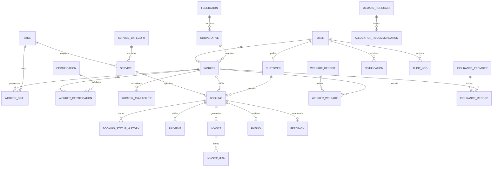

# Database Architecture & Entity Relationship Specification

## 1. Relational Entity Overview

The ON-DEMAND data layer is composed of **22 normalized relational tables** enforcing strict foreign key constraints, unique slot concurrency indexes, and audit logging.

---

## 2. Table Schemas & Definitions

### 2.1 Identity & Governance Tables
- **`federations`**: State federation metadata (e.g. Tamil Nadu Labour Cooperative Federation).
- **`cooperatives`**: Primary societies registered under the Cooperative Societies Act with district, registration number, and operating radius.
- **`users`**: Central authentication table with hashed bcrypt passwords, unique mobile numbers, and enum roles:
  - `CUSTOMER`
  - `WORKER`
  - `COOP_ADMIN`
  - `FED_ADMIN`
- **`customers`**: Household profile table containing address, geo-coordinates, and loyalty tier.
- **`workers`**: Member tradesperson records storing verification status (`REGISTERED`, `PENDING`, `UNDER_REVIEW`, `VERIFIED`, `REJECTED`), society affiliation, base coordinates, service radius, and calculated average rating.

### 2.2 Trade, Skill & Certification Tables
- **`service_categories`**: Broad trade groupings (Electrical, Plumbing, Carpentry, Painting, Driving, Cleaning, Gardening, Caregiving).
- **`services`**: Specific trade tasks with statutory wage decomposition:
  - `base_price`: Total standard fee.
  - `worker_earning`: Guaranteed 90% direct wage.
  - `coop_charge`: Statutory 10% society maintenance surcharge.
  - `requires_certification`: Boolean requiring valid trade licence.
- **`skills`**: Granular craft definitions (e.g. "Domestic wiring", "Pipe repair").
- **`worker_skills`**: Composite mapping of worker to skill with proficiency level and experience years.
- **`certifications`**: Recognized state certifications (ITI National Trade Certificate, NSDC Licence, Red Cross Aide).
- **`worker_certifications`**: Verified certificates linked to workers with credential numbers, issuing authorities, and expiry dates.
- **`worker_availabilities`**: Weekly recurring availability windows (weekday 0-6, start_time, end_time).

### 2.3 Booking & Concurrency Tables
- **`bookings`**: Central transaction entity:
  - Fields: `customer_id`, `worker_id`, `service_id`, `scheduled_date`, `start_time`, `duration_min`, `lat`, `lng`, `address`, `status`, `is_emergency`, `service_amount`, `coop_charge`, `total_amount`.
  - Composite Index: `ix_booking_worker_slot (worker_id, scheduled_date, start_time)` ensures high-speed concurrency lookups.
- **`booking_status_histories`**: Immutable audit log of all status transitions (`REQUESTED` $\rightarrow$ `CONFIRMED` $\rightarrow$ `IN_PROGRESS` $\rightarrow$ `COMPLETED`).
- **`emergency_requests`**: Instant dispatch requests with geo-radius tracking and response timestamps.

### 2.4 Payments & Invoicing Tables
- **`payments`**: Payment ledger recording transaction reference, amount, status (`PENDING`, `INITIATED`, `SUCCESS`, `FAILED`), and mandatory `is_demo` transparency flag.
- **`invoices`**: Formal cooperative receipts with unique numbering (`INV-COOP-XXXX`).
- **`invoice_items`**: Line-item breakdown displaying worker earning vs society maintenance surcharge.

### 2.5 Quality & Review Tables
- **`ratings`**: 1–5 star ratings linked to completed bookings with foreign key constraint ensuring single review per booking.
- **`feedbacks`**: Text review commentary from customers.

### 2.6 Social Security & Welfare Tables
- **`welfare_benefits`**: Government cooperative schemes (ESI Healthcare, Accident Indemnity, Pension Facilitation, Solar Upskilling).
- **`worker_welfares`**: Enrollment records tracking active member benefit status.
- **`insurance_providers`**: Insurance underwriting bodies labeled with `mode: "mock"`.
- **`insurance_records`**: Policy numbers, coverage limits, and demo attributions.

### 2.7 AI & Audit Tables
- **`demand_forecasts`**: Persisted 60-day moving average forecasts with demand levels (`LOW`, `MEDIUM`, `HIGH`) and algorithm mode.
- **`allocation_recommendations`**: Cross-society worker reallocation plans with admin approval state (`PENDING`, `APPROVED`, `REJECTED`).
- **`audit_logs`**: Tamper-evident administrative audit trail recording actor ID, action type, target entity, and timestamp.
